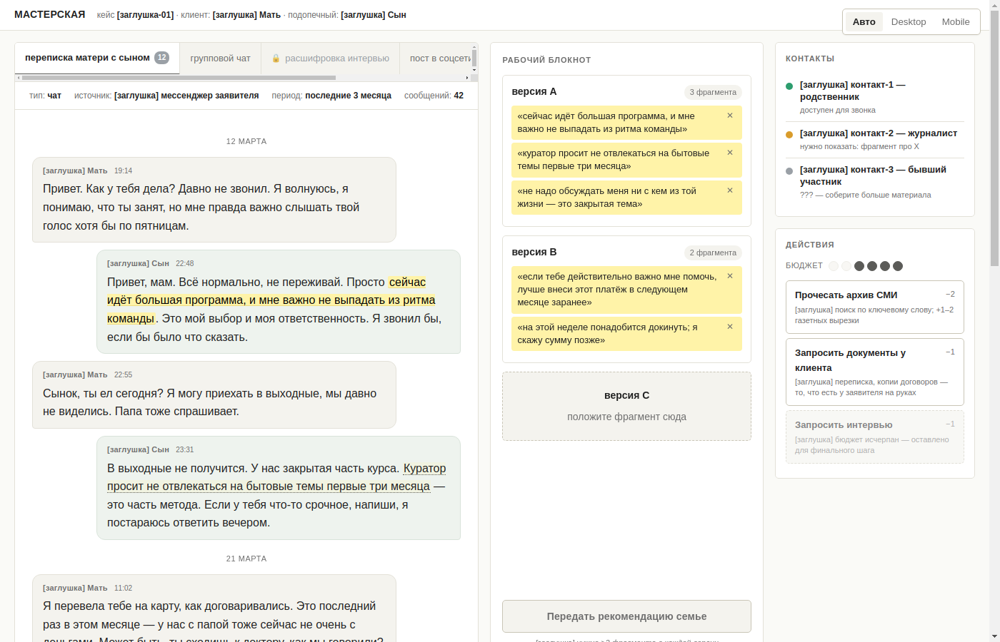
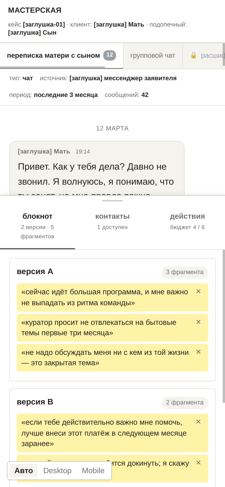

# Workspace mockup — 4-zone layout

Статический визуальный mockup игрового экрана «мастерская» из дизайн-пивота
(см. [`docs/GAME_DESIGN.md`](../../docs/GAME_DESIGN.md), §3–§5). Цель — зафиксировать
пропорции, иерархию и порядок чтения четырёх зон (документы / блокнот / контакты /
действия) до того, как Dev δ начнёт настоящую UI-имплементацию в `src/`.

В этом PR — **только статика**: один самодостаточный `index.html`, два скриншота и
этот README. Никакого React, никаких npm-зависимостей, никакого билд-степа.
Единственный JS — переключатель «Авто / Desktop / Mobile» (≈10 строк), чтобы можно
было снять оба варианта без перенастройки DevTools.

## Как посмотреть

```bash
open prototypes/workspace/index.html
```

Сервер не нужен. В Chrome:

1. Открыть файл — увидите авто-режим (раскладка следует ширине окна).
2. DevTools → Toggle device toolbar (`Ctrl+Shift+M`) → iPhone 14 Pro (390×844) —
   для мобильного breakpoint.
3. Альтернативно: на странице есть toggle справа-внизу (desktop) или слева-внизу
   (mobile) — «Авто / Desktop / Mobile». Выбор сохраняется в `localStorage`.

## Скриншоты

Desktop (≈1400×900):



Mobile (390×844, iPhone 14):



## Зоны

| Зона        | Desktop                                                            | Mobile                                                          |
|-------------|---------------------------------------------------------------------|-----------------------------------------------------------------|
| Документы   | Левая колонка, ~58% ширины, прокрутка контента вертикально.        | На весь экран сверху, прокрутка вертикально. Таб-бар скроллится горизонтально. |
| Блокнот     | Средняя колонка, ~33% ширины, sticky.                              | Таб «блокнот» в bottom sheet (active по умолчанию).             |
| Контакты    | Правый рейл (~280 px), верх.                                       | Таб «контакты» в bottom sheet.                                  |
| Действия    | Правый рейл (~280 px), низ (под контактами).                        | Таб «действия» в bottom sheet.                                  |

## Layout decisions made

Каждый пункт — осознанный выбор, который mockup отстаивает. Любое из них может
быть оспорено в ревью, но решение должно быть принято до того, как Dev δ начнёт
кодить.

1. **Документы — 55–60 %, не 33 %.** Длинное чтение прозы — главная активность
   игрока в кейсе. Симметричные три колонки выглядят аккуратно, но забирают
   реал-эстейт у того, ради чего игрок здесь. Если режется, то режется блокнот
   и рейл, а не документы.

2. **Блокнот — справа от документов, sticky.** Игрок постоянно сверяется с
   уже выделенными фразами. Если блокнот уезжает при скролле документа,
   рабочий ритм ломается. Sticky-колонка решает это без всплывающих окон.

3. **Контакты и действия — отдельный узкий рейл, не часть блокнота.** Это
   логически разные «инструменты»: блокнот — то, что игрок собрал, рейл — то,
   что он может сделать. Смешивать их в одной колонке — приглашение к путанице
   («почему контакт лежит рядом с моей гипотезой?»).

4. **Action-budget meter живёт в зоне действий, а не в топ-баре.** Игрок
   смотрит на бюджет ровно в момент решения «потратить или нет», то есть когда
   читает действие. Постоянно мигать им сверху — лишний визуальный сигнал, который
   рискует превратить меру в стресс-индикатор. (Этот выбор — кандидат для обсуждения,
   см. open questions.)

5. **Mobile: bottom sheet вместо top-tabs для блокнота / контактов / действий.**
   Глаза игрока на документе сверху, большой палец — внизу. Любой переключатель
   инструментов должен быть в большом-пальцевом радиусе. Top-tab заставляет
   ронять текст из взгляда + тянуться вверх каждый раз.

6. **Mobile bottom sheet — 3 таба (блокнот / контакты / действия), не стек.**
   Стек (все три зоны вертикально) на 390×844 сжимает каждую до неюзабельной
   высоты. Tabs дают одной зоне всё пространство — это полезнее, чем «всё видно
   но всё мелкое».

7. **Mobile sheet peek 80 px → раскрытие до ~60 vh, не модал.** Между «не видно
   совсем» и «занимает весь экран» — sheet, который виден всегда, но не съедает
   документ. Тап по табу разворачивает; повторный тап — сворачивает.

8. **Контакты — компактные карточки с цветным dot’ом, без аватаров и описаний.**
   Игрок различает три состояния (зелёный / жёлтый / серый) одним взглядом.
   Расширять карточку «когда нажмёшь» — окей; делать её всегда большой — нет.
   Максимум 3–4 контакта одновременно видимы; больше — скролл в зоне.

9. **Заблокированные документы — таб с замком и косой штриховкой, не отдельный
   список.** Игрок видит, что документ существует, и понимает, что для доступа
   нужно действие. Прятать их в «потенциально доступные» — снимать с игрока
   важный сигнал «здесь есть что-то ещё».

10. **Кнопка «Передать рекомендацию семье» — внизу блокнота, всегда disabled,
    с подсказкой о пороге.** Это финальное действие кейса. Делать его всплывающим
    или жить в отдельном экране — лишний шаг. Держать в одной колонке с
    гипотезами — естественно (рекомендация = сумма гипотез).

11. **Слот пустой гипотезы — пунктирный бордер + placeholder-текст, не «скрыт».**
    Игрок должен видеть, что есть третья версия, которую он ещё не наполнил.
    Это и подсказка, и слабый pressure-сигнал «не зацикливайся на двух
    версиях».

## Open layout questions for the conductor / Dev δ

Эти решения mockup намеренно не делает — у меня недостаточно контекста, нужно
решение по продукту.

- **Action-budget meter — в зоне действий или в топ-баре?** Если в топ-баре, он
  всегда на виду, что помогает на демке («экономика чувствуется»). Если в зоне
  действий — меньше визуальной перегрузки, но игрок может «забыть» сколько у него осталось,
  пока не откроет действия. Текущий mockup ставит в зону действий; для демки,
  возможно, стоит продублировать в топ-бар.

- **Когда контакт разблокирован — как игрок узнаёт?** Анимация / push / звук
  / просто «карточка появилась серая → стала жёлтая»? Анимация — точно
  территория Dev δ, mockup её не предлагает. Но сам сигнал нужен: иначе
  игрок узнаёт о разблокировке, только когда специально откроет панель.

- **Mobile bottom sheet — нужен ли swipe-to-expand?** Tap-по-табу разворачивает,
  свайп-handle сверху сейчас декоративный. Свайп — приятная фича, но требует
  гесчер-handlers, что выходит за рамки этого PR. Mockup просто фиксирует:
  место для свайп-handle есть, реализация — на Dev δ.

- **Сколько одновременно highlight’ов разрешается в блокноте на один слот
  до того, как он начнёт прокручиваться?** Сейчас mockup показывает 3 в слоте
  A — выглядит ок. На 6 будет тесно. Лимит? Скролл внутри слота? Авто-сворачивание
  старых?

- **Mobile: что если документ длинный (3 экрана прозы)?** Sticky tab-bar
  сверху всегда виден — это сейчас в mockup’е. Но плюс к нему: hint
  «выделите фрагмент…» — тоже sticky внизу? Или fade-out после первого
  использования?

- **Locked tabs — кликабельны (с тултипом «нужно действие X»), или совсем
  inert?** Mockup делает их inert (cursor: not-allowed). Альтернатива: клик
  показывает popover с подсказкой, чего не хватает. Это про доступность UX.

- **Контакты и действия — точно ли вертикальный стек на десктопе?** Альтернатива
  — горизонтальный (рядом). Стек экономит ширину (рейл получает всю), горизонталь
  — высоту. На 1400×900 стек норм; на 1280×720 может быть теснее.

- **Highlight в блокноте — цитата vs парафраз?** Сейчас в карточках в блокноте
  лежит цитата документа в кавычках. Альтернатива: короткое имя-парафраз
  («куратор просит не отвлекаться»). Парафраз чище визуально, но снимает с игрока
  возможность сразу проверить «я правильно понял?». Текущий выбор — цитата.

## Recommendations for production (Dev δ)

**Сохранить как есть:**

- Пропорции зон на десктопе (60/33/280 px) — это уже опираясь на «чтение —
  главная задача».
- Bottom sheet архитектуру на мобилке.
- Раздельные палитры для трёх состояний контактов (зелёный/жёлтый/серый).
- Полосатый фон у заблокированных табов — сильный визуальный сигнал.

**Развить:**

- Анимация перехода контакта серый → жёлтый → зелёный (когда разблокировался).
  Mockup намеренно без анимаций.
- Action-budget — продумать, нужна ли индикация «потратишь и не хватит на финал»
  ещё до того, как игрок нажмёт. Возможно — превью эффекта при hover’е.
- Сетка между mark’ами в документе и phrase-карточками в блокноте — связь
  должна быть визуально считываемой (наведение на phrase подсвечивает source
  в документе и наоборот).

**Отбросить / переосмыслить:**

- Эмодзи-замок в табах (`🔒`) — на проде заменить на SVG-иконку, чтобы не
  плыло на разных платформах.
- Hint-полоска внизу документа («выделите фрагмент…») — сейчас всегда виден.
  В проде — скрывать после первого выделения, чтобы не отнимать места.
- `localStorage` toggle — это техническое удобство для скриншотов; не нужно
  тащить в прод.

## Что НЕ в скоупе

- Контент: вся проза — заглушки. Реальные данные кейса-01 пишет β; имена
  персонажей и сюжетные детали зарезервированы. См. `docs/GAME_DESIGN.md` §5.
- Интерактив: drag-highlight, drop в слот, открытие документа по клику,
  переключение табов, кнопка «Передать рекомендацию» — всё это Dev δ.
- Контракты данных: `Document`, `KeyPhrase`, `Contact`, `InterviewTree` —
  описаны в дизайн-доке, но в этом PR не реализуются.

## Verification

Локально прогнано перед PR:

- `npm run lint` — clean.
- `npm run validate:investigation` — OK, 0 ошибок.
- `npm run audit:visible-language` — 0 warnings (HTML mockup не сканируется,
  но в нём вручную сверено отсутствие запрещённых слов: «шум», «улик»,
  «доказательств», «паттерн», «red herring», «фрейм», «love bombing»,
  «coercive control», «секта»).
- `npm run build` — OK, нет регрессий.
- Manual: открыто в Chrome desktop 1400×900 и DevTools mobile emulation
  iPhone 14 — обе раскладки рендерятся корректно.
